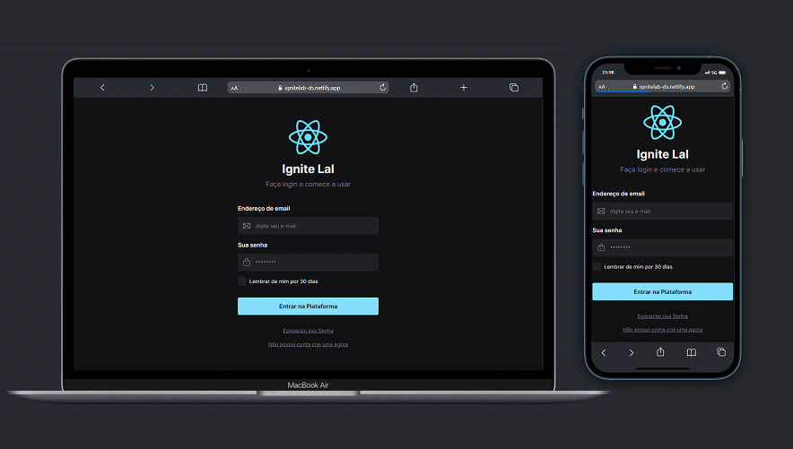

# Ignite Lab Designer System

Projeto Realizado no evento Ignite lab 3 da RocketSeat

[](https://app.netlify.com/sites/ignitelab-ds/deploys)

## Stack utilizada

**Front-end:** React, TypeScript, Storybook, TailwindCSS, postCSS, radix-ui

**Layout:** Figma

[](https://www.figma.com/file/zsGDrZLU0PmohZNCe17sxc/Ignite-Lab-3)

## Referência

 - [StoryBook](https://luiszkm.github.io/DesignerSystem_IgniteLab/?path=/story/components-checkbox--default)
 - [Aplicação](https://ignitelab-ds.netlify.app/)




## Instalação

Instale my-project com npm

```bash
# Clone este repositório
$ git clone <https://github.com/luiszkm/DesignerSystem_IgniteLab.git>

# Instale as dependências
$ npm install

# Execute a aplicação em modo de desenvolvimento
$ npm run dev

```
    
## Licença

[MIT](https://choosealicense.com/licenses/mit/)


## Apêndice

Feito com :heart: e dedicação por mim :rocket:

[](https://www.linkedin.com/in/luis-soares-64b0a6227/)

